# Introduce

-   Website is cloned from https://phongtro123.com/
-   Frontend: NextJs
-   Backend: NestJs
-   Database: mysql (Sequelize)
-   Image: cloudinary (https://cloudinary.com/)

# Features

-   Filter
-   Pagination
-   CRUD Posts
-   Authentication with JWT
-   Persist login - protected routes

# Screenshots

-   home page

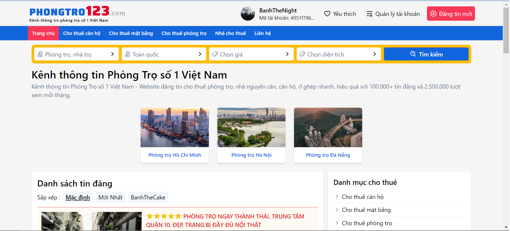

-   Filter

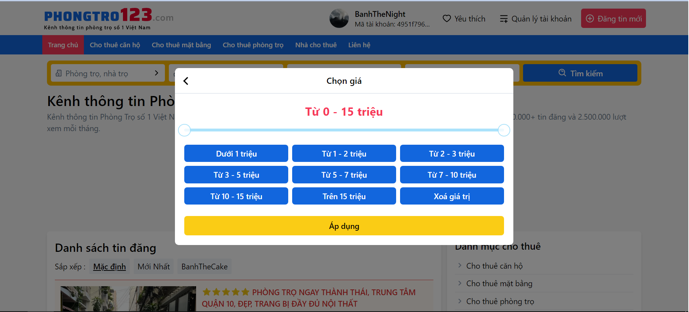

-   Pagination

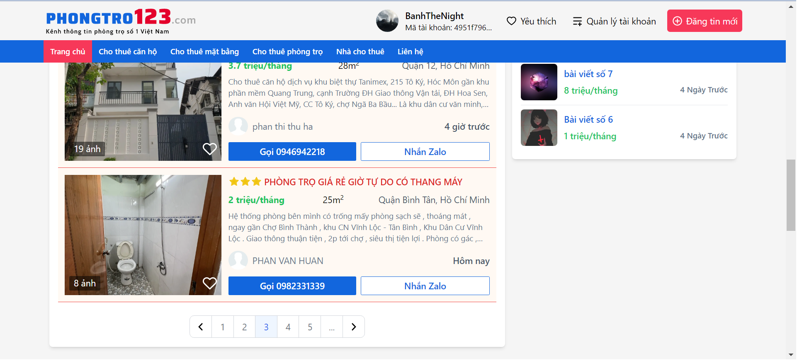

-   Login

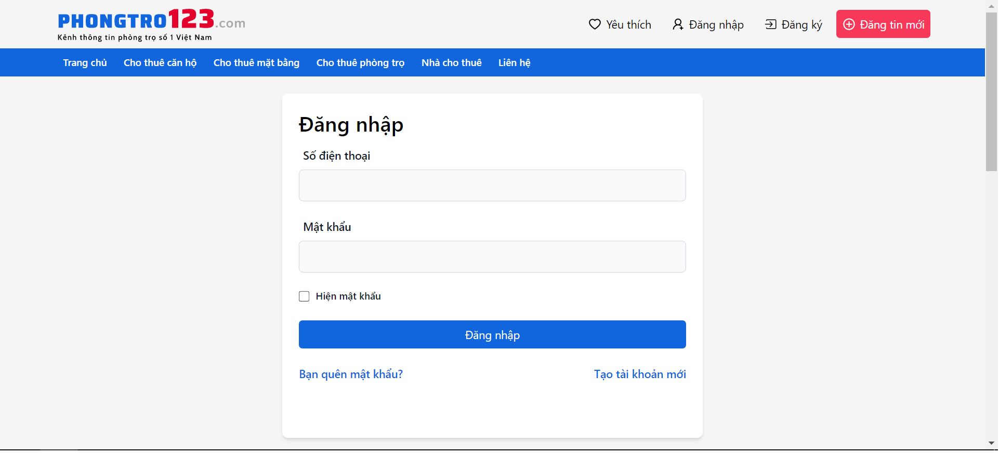

-   Register

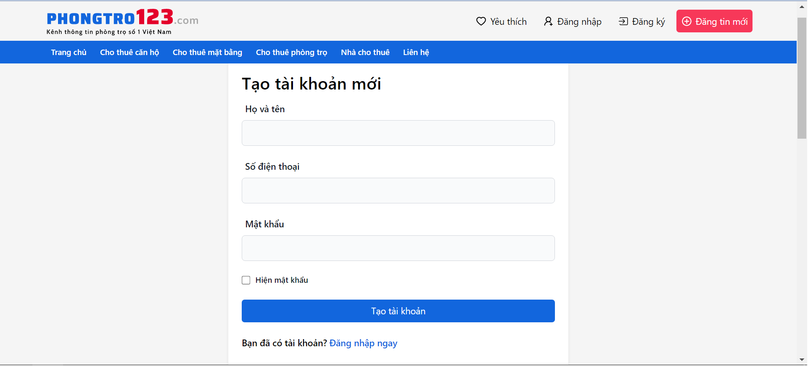

-   Details post

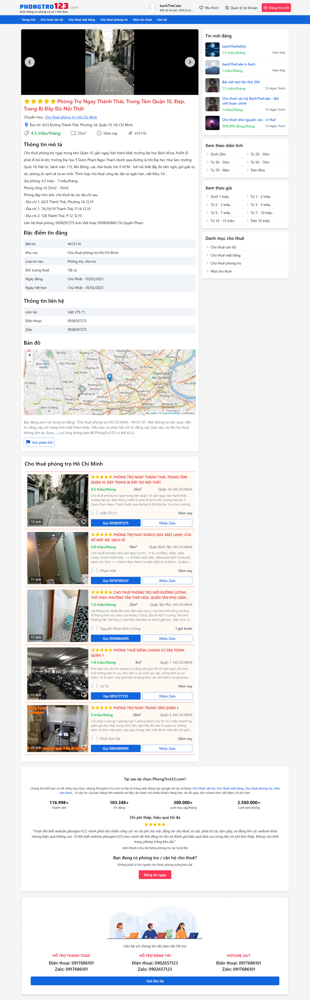

-   Manage posts

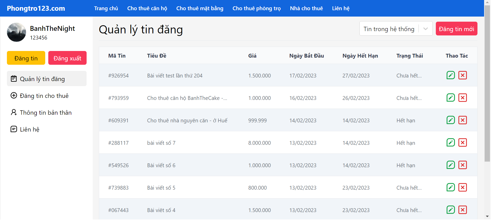

-   Edit post

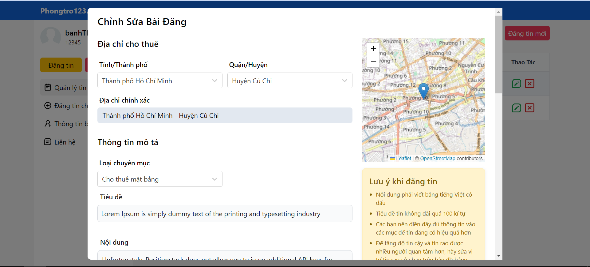

-   Create post

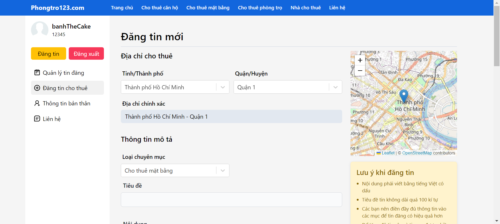

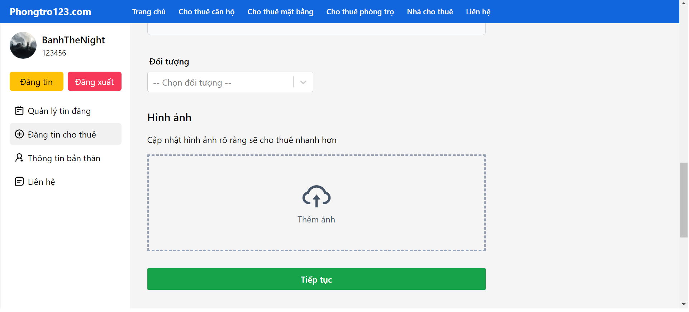

-   Update info

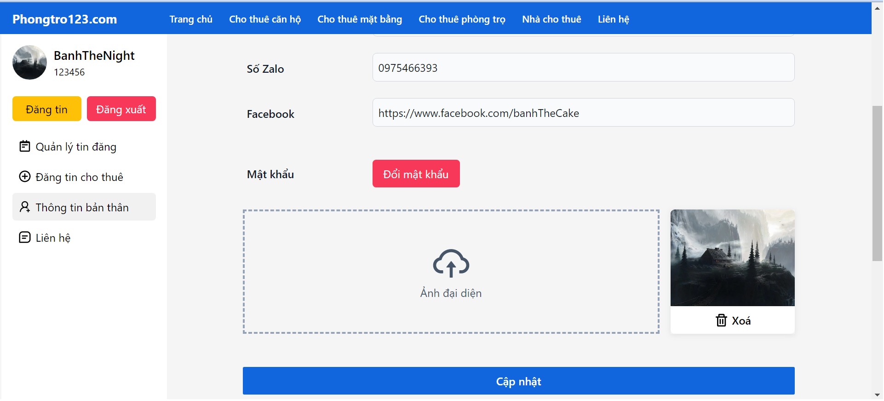

-   Change password

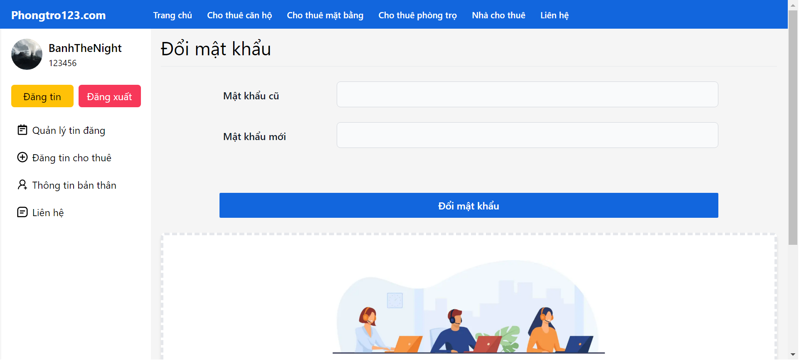
